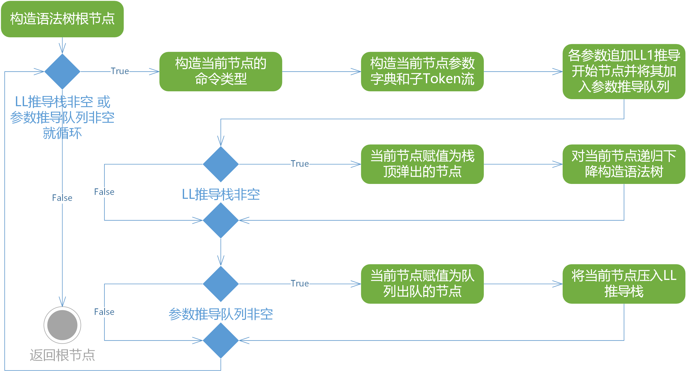
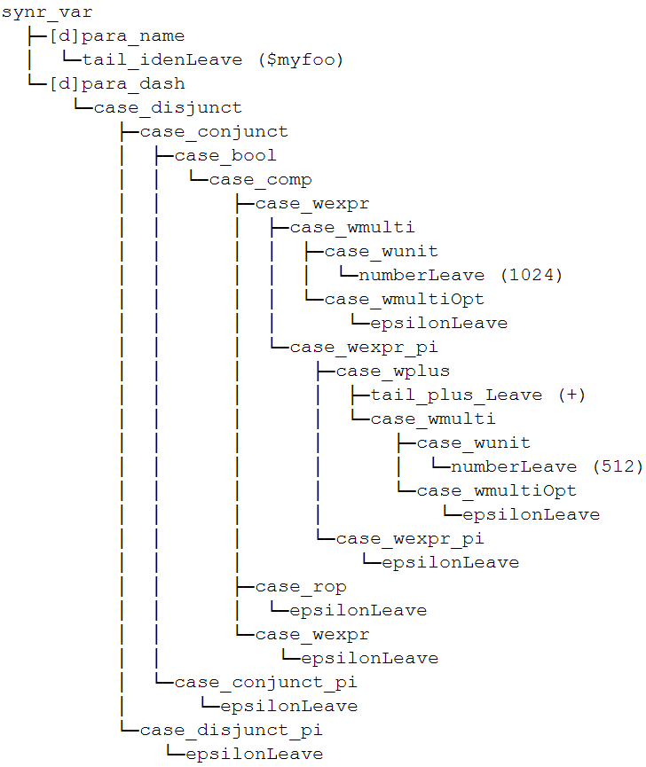

## 语法分析

对表达式的文法在消除了左递归与二义性之后，结合上下文无关文法和LL(1)预测分析表，先从输入Token流中决定该脚本命令行的命令类型并决定语法树根节点的类型，采用上述的LL(1)递归下降的语法分析方法来对当前命令的每个属性等号右边的表达式生成**语法分析树**，并把它绑定到该命令的对应参数名的参数字典上。整个语法分析的过程如图所示。<br/>



语法分析的结果是生成了一棵**语法分析树**，它的根节点包含了它在脚本行中的命令类型和位置戳，它还包含了一个以参数名称作为键，参数值所对应的LL(1)表达式推导根节点作为值的**字典对象**，上一小节中的Yuriri脚本语句行所对应的语法分析树如下图所示。语法分析树将被返回到编译器控制器，并交由语义分析器去继续进行剩余的编译工作。



Yuriri的非上下文无关性质决定了它不能简单地使用LL(1)递归下降来进行语法分析生成语法分析树，因此引擎使用非LL(1)推导队列和收缩的表达式LL(1)文法递归下降推导相结合的技巧来完成语法分析工作。<br/>
该方案的核心是在LL(1)递归下降语法分析的基础上，引入一个参数待推导队列`ParameterDerivateQueue`，在匹配栈`LL1ParseStack`为空时就提取队列里的项目继续展开。语法分析器对于每一个输入的脚本行（非对话的情况，因为对话是不以符号`@`开头的，而注释在词法分析阶段已经被剔除了，对话情况将被特殊处理），跳过其符号`@`直接看第二个Token，即命令主Token，以此来构造这个脚本行的语法树根节点并附上命令类型，语法分析器会为命令构造对应的参数字典，得到一个语法树根节点，它带有该命令类型，以及该命令对应的一个参数字典。随后，对参数字典中的每个属性的值追加一个可用于LL(1)递归下降推导的表达式文法。通过这样的策略，表达式求值的文法被收缩成**上下文无关文法**，注意这个表达式文法是用来解析每个命令属性**等号右边**的表达式的，它可以使用递归下降算法来进行解析。<br/>
完成上述步骤构造完语法树根节点后，语法分析栈里没有可用于LL(1)推导的项目，因此从待推导队列中取出队头，它是该命令的一个属性的值表达式语法树根节点，将它压入语法匹配栈，做LL(1)递归下降的语法分析，最后得到一棵等价于该表达式的语法分析树。因此，语法分析器最后输出了一棵特殊的语法分析树，它的根节点类型为脚本命令的类型，没有直接的孩子，拥有一个<**属性名**，**属性值表达式语法分析树根节点**>字典，这些字典的值都是严格意义上的**LL(1)-AST树**，可以通过**递归遍历求值**。<br/>
该算法的伪代码如下所示，其中`BeginNode`是初始推导节点，LL1ParseStack和**ParameterDerivateQueue**是匹配栈和待推导队列：
```
rootNode, currentNode ← BeginNode
WHILE NOT end of Token stream DO
  IF LL1ParseStack NOT empty OR ParameterDerivateQueue NOT empty
    currentNode ← construct tree node by parsing the 2nd token to a command
    construct the parameter dictionary and their sub token stream of currentNode
    FOREACH parameter IN currentNode.parameterDictionary
        ParameterDerivateQueue.Enqueue(LL1 derivation root for parameter)
    END FOR
  END IF
  IF LL1ParseStack NOT empty
    currentNode ← LL1ParseStack.Pop()
    do LL1 recursive descent derivation on currentNode with currentNode.SubTokenStream
  END IF
  IF ParameterDerivateQueue NOT empty
    currentNode ← ParameterDerivateQueue.Dequeue()
    LL1ParseStack.Push(currentNode)
  END IF
END WHILE
RETURN rootNode
```
