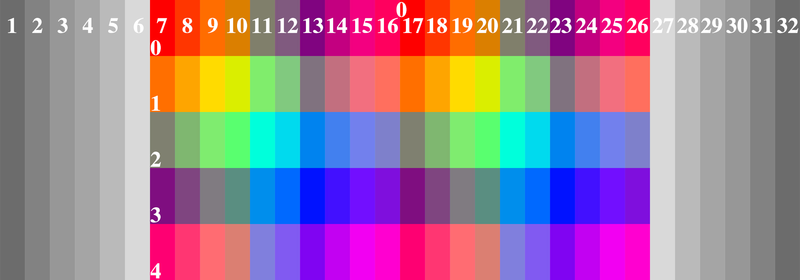

## 2D世界
Yuri引擎可以工作在2D模式下，在此模式下，精灵被划分为三种类型：背景、立绘、贴图。由三个**2D视窗容器**`Viewport2D`去包装这些精灵对象。视窗容器的引入是为了方便过场和动画效果可以被作用到容器中的所有对象。 

### 2D视窗
**2D视窗容器**`Viewport2D`对象包含了这些属性：

| 属性名 | 作用 |
| :-------- | :-------- |
| Type | 获取或设置视窗类型（背景、立绘、贴图） |
| ViewboxBinding | 获取或设置视窗所绑定的WPF视窗Viewbox对象 |
| CanvasBinding | 获取或设置视窗所绑定的WPF画布Canvas对象 |
| TranslateTransformer | 获取或设置视窗所绑定的平移变换器 |
| ScaleTransformer | 获取或设置视窗所绑定的缩放变换器 |
| RotateTransformer | 获取或设置视窗所绑定的旋转变换器 |

它的可序列化描述子`Viewport2DDescriptor`的属性如下：

| 属性名 | 作用 |
| :-------- | :-------- |
| Type | 获取或设置视窗类型（背景、立绘、贴图） |
| Left | 获取或设置视窗相对系统窗口左边界的距离 |
| Top | 获取或设置视窗相对系统窗口上边界的距离 |
| ZIndex | 获取或设置视窗在系统窗口上的深度 |
| ScaleX | 获取或设置视窗横向缩放比 |
| ScaleY | 获取或设置视窗纵向缩放比 |
| AnchorX | 获取或设置视窗动画X锚点 |
| AnchorY | 获取或设置视窗动画Y锚点 |
| Angle | 获取或设置视窗旋转角度 |

### 背景过场动画
背景过场动画**Transition**是2D舞台模式下所特有的。它的底层实现是引用了WPF的**Transition**模块，一共提供了22种过场特效：

| 过场特效名 |
| :---: |
| Fade |
| Star |
| Rotate |
| VerticalWipe |
| Page |
| Roll |
| Diamonds |
| VerticalBlinds |
| HorizontalWipe |
| FadeAndBlur |
| Explosion |
| Checkerboard |
| Translate |
| RotateWipe |
| Melt |
| DiagonalWipe |
| Flip |
| Dots |
| FadeAndGrow |
| DoubleRotateWipe |
| Door |
| HorizontalBlinds |

在Yuriri脚本中使用过渡效果时，首先应该将要到达的目标图像放置在**背景层**，然后使用过渡指令来交换背景层和前景层的内容就可以演绎出过场特效。 
在技术实现上，前端管理器根据相应的描述子，将过渡效果的字符串名字转换为过渡特效对象，随后交换前景层和背景层的精灵对象，将过渡容器`TransitionElement`的内容属性`Content`设置为目标图片在前端的控件对象。

### 2D下的场景镜头动画
2D场景镜头类`SCamera2D`为游戏提供模拟3D景深效果的镜头移动动画，以实现更流畅的关于镜头的演出。2D场景镜头所实现的场景镜头本质上是对不同类型2D视窗对象进行不同程度的移动和放缩以模拟3D景深效果。 
在讨论场景镜头系统之前，先介绍Yuri引擎中的画面分区机制。Yuri将屏幕横向划分为20块，纵向划分为15块。其示意图如下（图中**没有**完整画出所有纵向分区）：

由于横向分区规定是偶数个，横向分区还有一个特殊的分区号**0**，它代表的是屏幕正中央；而纵向分区是奇数个，因此的屏幕中央其实就是分区总数的一半，默认是**7**。
注意到屏幕左右两侧1-6和27-32分区是处于屏幕外侧的，引入这些分区的意义是让舞台可以比游戏窗体更大以便实现一些特殊演出，例如立绘人物很多的场景等。 
游戏中人物立绘的中心必须位于某个区块的中心点，这是使用场景镜头系统的前提条件。这是因为2D场景镜头的焦点只能对准某一区块的中心点。 
基于屏幕分区机制，2D场景镜头系统可以提供这些服务：

| 方法名 | 作用 |
| :-------- | :-------- |
| Translate(**int** r, **int** c) | 将镜头中心平移到指定的区块 |
| FocusOn(**int** r, **int** c, **double** ratio, **bool** immediate) | 以某个区块为焦点调整焦距 |
| ResetFocus() | 重置镜头将中央和焦点都对准屏幕中心并采用1.0的对焦比例 |
| Focus(**double** ratio)| 在镜头聚焦的区块上调整焦距 |
| PreviewEnterScene() | 布置场景结束并准备进入时调用此方法以准备动画 |
| PostEnterScene() | 进入场景并做默认拉长焦距效果 |
| LeaveSceneToBlackFrame() | 离开场景并切入黑场 |
| ResumeBlackFrame() | 直接从黑场中恢复 |

同时2D场景镜头系统可以提供一些辅助函数：

| 方法名 | 作用 |
| :-------- | :-------- |
| GetScreenCoordination(**int** r, **int** c) | 获取屏幕分区的中心坐标 |
| GetScreenDistance(**int** rA, **int** cA, **int** rB, **int** cB, **double** scale) | 获取指定焦距下屏幕分区之间的曼哈顿距离 |
| SkipAll() | 立即跳过所有动画 |
| IsAnyAnimation | 获取是否有动画正在进行 |

在技术上，2D场景镜头系统非常复杂。在这里只讲述其几个主要特效的实现思路，不展开讨论它的技术实现细节。

- **对焦缩放**：修改3个2D视窗（背景、立绘、前景，下文同）的尺度变换对象的锚点位置，然后对它们的Scale依赖项属性做同步的插值动画。需要注意的是，由于透视效果，这三个视窗的锚点位置是不相同的，它们有序地落在以屏幕（镜头）发射出的一条射线上
- **平移**：模拟镜头平移的效果即是反向地、有差别地移动2D视窗，在不同尺度下，各视窗偏移量是不相同的
- **黑场效果**：在主窗体的最上层放置一个Frame，控制该Frame的依赖项属性来达到黑场效果

事实上，2D场景镜头系统是在2D的画布上模拟3D景深效果，它有着一些天然的限制和不足，目前它的缩放尺度只能是[0.5, 2.0]区间内，如果超出这一区间，很可能在做平移动作时镜头中心会对不准区块中心。 
在不需要使用过场动画效果的情况下，请尽量使用**3D场景镜头系统**来避免使用2D场景镜头系统。

### 程序集信息
| Property | Value |
| :-------- | :--------: |
| 层次结构 | Yuri.PlatformCore.Graphic.Viewport2D |
| 最低版本 | 1.0 |
| 并行安全 | 是 |
|||
| 层次结构 | Yuri.PlatformCore.Graphic.Viewport2DDescriptor |
| 最低版本 | 1.0 |
| 并行安全 | 是 |
|||
| 层次结构 | Yuri.PlatformCore.Graphic.SCamera2D |
| 最低版本 | 1.0 |
| 并行安全 | 否 |
