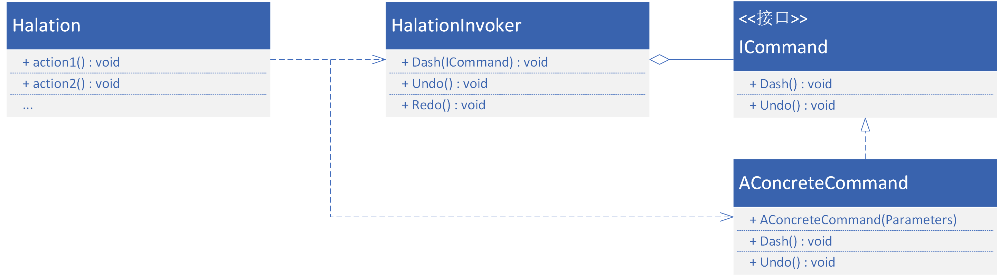

## 命令模式
图形化编程还有另一个重要操作：撤销与重做。实现可撤销的图形化编程需要引入命令设计模式，使开发环境主程序Halation和各命令可以被分别看作行为的请求者和行为的执行者，实现主程序逻辑与各命令具体操作的解耦合。 
行为的执行者即各种命令都继承自同一个接口`ICommand`，它继承并重写了执行虚方法`Dash`和撤销虚方法`Undo`。行为的请求者维护着两个命令栈：撤销栈和重做栈。当一个命令被请求时，它被压入撤销栈，并执行此的`Dash`方法；当进行撤销操作时，命令从撤销栈弹出，压入重做栈，同时执行`Undo`方法；重做的过程与撤销正好相反。命令模式的引入使各种复杂的命令可以在主程序里用同样的逻辑做撤销/重做处理。 Halation中的命令模式类图如下：
 

