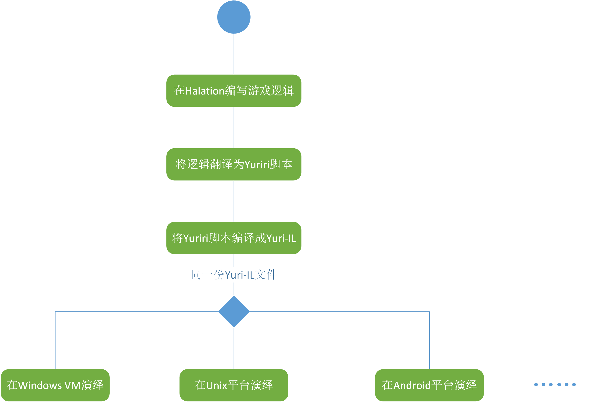

## Yuri AVG Engine

Project Yuri将着眼于设计一个包含基本AVG游戏所需功能的引擎套装。它通过可视化开发IDE Halation，将用户的演出业务逻辑翻译为脚本语言Yuriri，利用脚本解释器Yuri Interpreter编译脚本、进行代码优化并将之转化为机器无关的代码Yuri IL，最后交给以Yuri Platform规范接口实现的运行时环境来进行解释演绎游戏。

系统基于.NET Framework 4 + WPF，以C#为主要开发语言。可视化IDE的引入使程序员编码和演出人员、素材人员的工作得以分开，程序员也不需要考虑底层的实现，只需要关注游戏的业务逻辑；演出人员、素材人员也可以在Halation中方便地管理自己的演出文档和资源。同时，由于这种高级语言虚拟机式的体系架构，针对不同的运行平台，只需要对Yuri Platform接口编写目标平台上的运行时环境虚拟机，用同一份脚本就可以在不同的平台上运行，实现了跨平台的可能性。

欢迎来到Yuri世界！

This project will focus on design AVG script engine with basic required functions. Development is performing in a visual IDE, called Halation. The expected performance will be translated for the scripting language, Yuriri Script. The script interpreter, Yuri Interpreter, is responsible for analyzing scripts, optimizing them and transforming scripts for machine independent code called Yuri IL, and finally a virtual machine platform implemented for Yuri Platform interface will provide a run-time environment for the Yuri IL, interpreting them and show players the game scenes.

It based on .NET Framework 4.0 and WPF, with C# as the development language. Visual IDE enables the work of programmers, performers and artist can be separated, the programmer does not need to consider the underlying implementation, only need to focus on the game business logic; other staff such as performers, artist and musician can also manage their resource through their modules in Halation. At the same time, due to the high-level language virtual machine architecture, it only need to rewrite the target platform VM for Yuri Platform interface, with a script can be run on different platforms, which contains the extension of the cross-platform.

